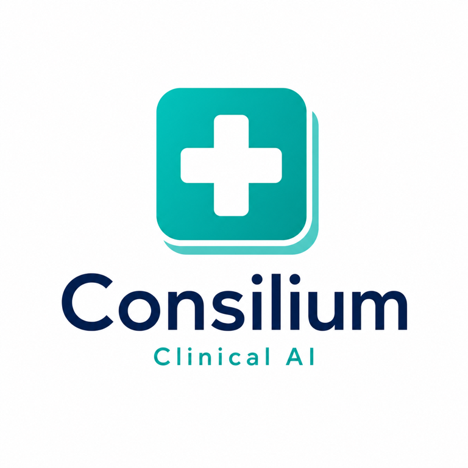
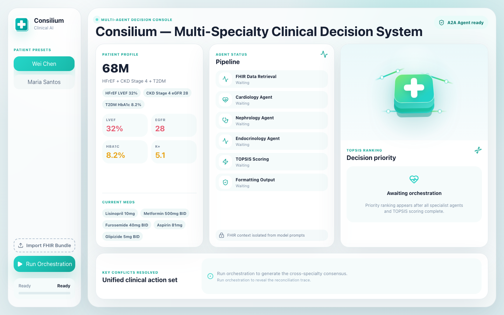

# Consilium

<p align="center">
  
</p>

> **Multi-specialty clinical decision support for complex chronic disease patients.**
> Consilium reduces guideline conflict, medication-safety risk, and physician decision fatigue by combining specialist LLM agents with deterministic clinical ranking.

**Built for [Agents Assemble: The Healthcare AI Endgame](https://agents-assemble.devpost.com/).**

---

## Problem

Patients with heart failure, diabetes, and chronic kidney disease often receive recommendations from multiple specialists whose guidelines collide:

- Cardiology may prioritize guideline-directed HF therapy.
- Nephrology may prioritize renal dosing, potassium, and eGFR thresholds.
- Endocrinology may prioritize glycemic control and cardiometabolic benefit.

The primary care physician is left to reconcile tradeoffs manually. Consilium turns that reconciliation into an explainable, auditable workflow: specialist recommendations are generated separately, validated structurally, and ranked with deterministic multi-criteria scoring.

## Solution

Consilium exposes one A2A endpoint that can be connected to Prompt Opinion. At runtime it:

1. Reads patient context from Prompt Opinion FHIR metadata when available, or from clinician-entered text when not.
2. Calls three ADK specialist agents: cardiology, nephrology, and endocrinology.
3. Requires each specialist to return structured JSON: `specialty`, `recommendation`, `risks`, and `citation`.
4. Converts those outputs into deterministic TOPSIS inputs.
5. Returns a ranked clinical decision, action plan, conflicts resolved, citations, and a safety disclaimer.

If the text input lacks enough patient-specific information, Consilium refuses to invent a plan and asks for more clinical context.

## Live Integration

**Live frontend demo:** https://frontend-feb0iff2s-eiddies-projects-d06b2ce6.vercel.app



| Layer | Current Implementation |
|---|---|
| A2A Backend | Cloud Run service serving `orchestrator.app:a2a_app` |
| Platform | Prompt Opinion BYO A2A agent connection |
| Patient Context | Prompt Opinion FHIR context extension + SMART scopes |
| Specialist Models | DeepSeek V4 Flash through LiteLLM |
| Frontend Demo | React/Vite clinical workspace deployed on Vercel |
| Local Fallback | Direct free-text patient summary when no FHIR context is present |

The agent card advertises the official Prompt Opinion FHIR extension:

```text
https://app.promptopinion.ai/schemas/a2a/v1/fhir-context
```

## Architecture

```text
Prompt Opinion / React Demo
        |
        | A2A message/send
        v
Consilium Orchestrator
        |
        | FHIR context if available
        v
FHIR patient summary
        |
        | ADK Runner calls
        +---------------------+----------------------+----------------------+
        v                     v                      v
 Cardiology Agent       Nephrology Agent      Endocrinology Agent
   ACC/AHA HF              KDIGO CKD              ADA Diabetes
        |                     |                      |
        +---------- structured JSON recommendations -+
                              |
                              v
                 Deterministic TOPSIS scorer
                              |
                              v
              Ranked decision + conflicts resolved
```

### Architecture Reality

This version implements **parallel specialist consult + deterministic reconciliation**. The agents do not yet conduct a multi-round negotiation with each other. That is intentional for the hackathon build: it keeps the decision path inspectable, reliable, and fast enough for live A2A demos. A future version should add a negotiation loop where specialists exchange rationale and revise recommendations before TOPSIS ranking.

## Clinical Scoring Method

The LLM specialists do **not** assign TOPSIS scores. They only produce recommendations, risks, and citations. Consilium computes scoring dimensions in code.

| Dimension | Default Weight | How It Is Computed |
|---|---:|---|
| Evidence Level | 0.30 | Deterministic mapping from guideline labels such as ACC/AHA Class I, KDIGO Grade 1A, ADA Level A |
| Patient Match | 0.30 | Deterministic match to patient state: LVEF, eGFR, HbA1c, HF, CKD, diabetes |
| Medication Safety | 0.20 | Deterministic penalty from risk flags such as hyperkalemia, lactic acidosis, hypotension, volume depletion |
| Guideline Priority | 0.20 | Deterministic guideline-strength proxy using the same evidence hierarchy |

Dynamic patient-state weighting is implemented for safety-critical cases:

| Trigger | Weights |
|---|---|
| eGFR <30 and patient is on Metformin | Evidence 0.20, Patient Match 0.25, Medication Safety 0.35, Guideline Priority 0.20 |
| LVEF <35 without the renal-safety override | Evidence 0.25, Patient Match 0.25, Medication Safety 0.20, Guideline Priority 0.30 |

The renal-safety override takes precedence because eGFR <30 + Metformin is an immediate medication-safety conflict.

## Example Cases

### Case A: HFrEF + CKD4 + T2DM + Metformin

**Input:** 68M, HFrEF LVEF 32%, CKD stage 4 eGFR 28, T2DM HbA1c 8.2%, on Lisinopril, Metformin, Furosemide.

| Rank | Specialty | Score | Why |
|:---:|---|---:|---|
| 1 | Nephrology | 0.900 | eGFR <30 makes Metformin safety the highest-priority conflict |
| 2 | Endocrinology | 0.625 | Diabetes therapy must change, also supports SGLT2i |
| 3 | Cardiology | 0.350 | HFrEF therapy matters, but unresolved renal safety is more urgent |

**Conflict resolved:** Stop Metformin; start SGLT2i if tolerated; continue ACEi/ARB with potassium and creatinine monitoring.

### Case B: HFpEF, Normal Kidney Function, No Diabetes

**Input:** 55F, HFpEF LVEF 58%, eGFR 82, no diabetes, no kidney disease, on Lisinopril and Carvedilol.

| Rank | Specialty | Score | Why |
|:---:|---|---:|---|
| 1 | Cardiology | 0.900 | HF phenotype drives the only active specialty priority |
| 2 | Endocrinology | 0.625 | No glucose-lowering therapy is indicated |
| 3 | Nephrology | 0.350 | No CKD-specific medication conflict detected |

**Conflict resolved:** No Metformin or CKD conflict is invented; the output stays scoped to the available patient data.

### Case C: Insufficient Patient Context

**Input:** `Run the full multi-specialty orchestration for this patient.`

**Output:** Consilium returns `More Patient Information Needed` and does not call specialist agents or TOPSIS. This prevents the model from hallucinating a clinical plan when neither FHIR context nor a meaningful patient summary is available.

## Safety & Reliability

- **FHIR-aware:** reads `fhirUrl`, `fhirToken`, and `patientId` from A2A metadata when Prompt Opinion sends FHIR context.
- **No token leakage:** production defaults do not log full JSON-RPC bodies, FHIR tokens, patient ids, or full FHIR payloads.
- **Minimum-context gate:** insufficient free-text requests are rejected before specialist LLM calls.
- **Specialist contract validation:** malformed JSON, missing required fields, wrong specialty, or empty recommendations are rejected.
- **Per-specialist fallback:** one failed or timed-out specialist falls back deterministically without failing the whole task.
- **A2A compatibility:** middleware accepts `SendMessage`, `SendStreamingMessage`, `ROLE_USER`, `ROLE_AGENT`, `messageId`, and `message_id` variants.
- **CORS-ready:** browser demos can call the deployed A2A service.

## Tech Stack

| Component | Technology |
|---|---|
| Agent Framework | Google ADK |
| A2A Transport | A2A JSON-RPC endpoint |
| Platform | Prompt Opinion |
| LLM Provider | DeepSeek V4 Flash via LiteLLM |
| Decision Engine | Custom TOPSIS implementation |
| Clinical Data | FHIR R4 + SMART scopes |
| Backend Runtime | FastAPI/Starlette through ADK A2A adapter |
| Frontend | React + Vite + lucide-react |
| Deployment | Google Cloud Run |

## Quick Start

```bash
git clone https://github.com/eiddiedev/Consilium.git
cd Consilium

python -m venv .venv
source .venv/bin/activate
pip install -r requirements.txt

cp .env.example .env
# Set DEEPSEEK_API_KEY and API_KEYS.
# Defaults use deepseek/deepseek-v4-flash via LiteLLM.

uvicorn orchestrator.app:a2a_app --host 0.0.0.0 --port 8003
curl http://localhost:8003/.well-known/agent-card.json
```

### A2A Smoke Test

```bash
source .env
curl -sS -X POST http://localhost:8003/ \
  -H 'Content-Type: application/json' \
  -H "X-API-Key: ${API_KEYS%%,*}" \
  -d '{
    "jsonrpc": "2.0",
    "id": "demo",
    "method": "message/send",
    "params": {
      "message": {
        "role": "user",
        "messageId": "demo-message",
        "parts": [{
          "kind": "text",
          "text": "68-year-old male with HFrEF LVEF 32%, type 2 diabetes HbA1c 8.2%, CKD eGFR 28. Current medications: Lisinopril, Metformin, Furosemide, Aspirin, Glipizide."
        }]
      }
    }
  }'
```

### Frontend Demo

```bash
cd frontend
cp .env.example .env
# Set VITE_A2A_AGENT_URL and VITE_A2A_API_KEY.
npm install
npm run dev
```

## Verification

```bash
# Backend unit/regression tests
.venv/bin/python -m pytest -q

# Frontend build
cd frontend && npm run build

# Agent card
curl -sS http://localhost:8003/.well-known/agent-card.json

# A2A smoke
curl -sS -X POST http://localhost:8003/ \
  -H 'Content-Type: application/json' \
  -H "X-API-Key: ${API_KEYS%%,*}" \
  -d '{"jsonrpc":"2.0","id":"smoke","method":"message/send","params":{"message":{"role":"user","messageId":"smoke-message","parts":[{"kind":"text","text":"55-year-old female with HFpEF LVEF 58%, eGFR 82, no diabetes, no kidney disease. Current medications: Lisinopril and Carvedilol."}]}}}'
```

Expected:

- Tests pass.
- Agent card includes `securitySchemes`, `supportedInterfaces`, Prompt Opinion FHIR extension URI, and SMART scopes.
- A2A response returns a completed task artifact.
- Logs show only safe FHIR status summaries unless `LOG_FHIR_DEBUG=true` is explicitly set.

## Project Structure

```text
Consilium/
├── orchestrator/          # Main A2A endpoint and orchestration logic
├── cardiology_agent/      # ACC/AHA-oriented specialist agent
├── nephrology_agent/      # KDIGO-oriented specialist agent
├── endocrinology_agent/   # ADA-oriented specialist agent
├── shared/                # A2A app factory, middleware, FHIR hooks/tools
├── tools/                 # TOPSIS scorer and helper tools
├── frontend/              # React demo UI
├── data/                  # Example FHIR bundles and guideline weights
└── tests/                 # TOPSIS, parser, safety, and regression tests
```

## Known Limitations

- Current specialist agents run in parallel and do not yet negotiate with each other in a multi-turn deliberation loop.
- The system has not been validated against clinical outcomes or physician time-motion studies.
- Guideline mappings are intentionally narrow for the hackathon scope: HF, CKD, and diabetes medication conflicts.
- This is advisory clinical decision support, not autonomous prescribing software.

## Evidence Sources

- ACC/AHA 2022 Heart Failure Guideline: https://www.jacc.org/doi/10.1016/j.jacc.2021.12.012
- KDIGO 2024 CKD Guideline: https://kdigo.org/guidelines/ckd-evaluation-and-management/
- ADA 2025 Standards of Care in Diabetes: https://diabetesjournals.org/care/issue/48/Supplement_1

## Disclaimer

Consilium is a clinical decision support tool. It does not replace physician judgment, local policy, patient preference, or emergency clinical assessment. Final treatment decisions rest with the treating clinician.

## License

MIT
